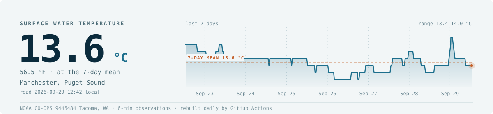

I'm Steven — I work at the **University of Washington**, where I study shellfish,
genomes, and the places those two things collide. Nearly everything I do ends up
in a repo somewhere: code, data, half-finished analyses, and the occasional idea
that didn't survive contact with the data.

<!-- WATER:START -->

`13.5 °C` in the water off Manchester, Puget Sound, Oct 8 13:24 local, via NOAA CO-OPS Tacoma, WA.
<!-- WATER:END -->

That number is real, and it's a decent indicator of where I am. If I've gone
quiet on here, odds are I'm standing in it — out at a shellfish farm doing the
part of this job that no amount of compute will do for me.

#### From the notebook

Whatever comes of either half — a methylation signal, a genome assembly that
finally behaves, or a bag of oysters that didn't — gets written up here.

<!-- NOTEBOOK:START -->

**[Ploidy and pH Don’t Move Methylation, Genotype Does](https://sr320.github.io/tumbling-oysters/posts/93-haws-methylation-null/)**  
Haws diploid and triploid *C. gigas*, high vs. low pH, 6 oysters per ploidy × pH cell (24 total, WGBS). Earlier passes (04-methylKit, 04-DSS)…  
Oct 2, 2026 · Epigenetics · Computing

**[Olympia Oyster lcWGS on the New Chromosome Assembly](https://sr320.github.io/tumbling-oysters/posts/92-oly-lcwgs-structure/)**  
The oly-lc-WGS repo holds low-coverage whole genome sequencing for 112 Olympia oysters (*Ostrea lurida*) from 15 sites: 13 around Puget Sound plus…  
Sep 28, 2026 · Genomics · Computing

**[Oil vs. Control Ranks 9 of 10 Label Splits](https://sr320.github.io/tumbling-oysters/posts/91-gulf-oil-methylation/)**  
SRP139854 (BioProject PRJNA449904) is six eastern oyster gill libraries from 2015: three unexposed (NB3, NB6, NB11) and three exposed to 25,000 ppm…  
Sep 26, 2026 · Epigenetics · Genomics

Latest from [Tumbling Oysters](https://sr320.github.io/tumbling-oysters/) · refreshed daily by GitHub Actions
<!-- NOTEBOOK:END -->
